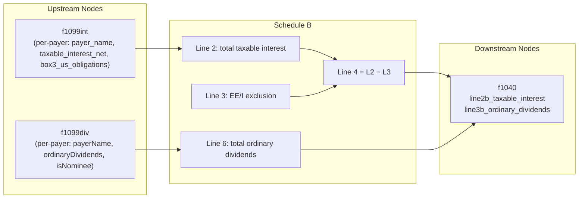

# Schedule B — Interest and Ordinary Dividends

## Overview

Schedule B aggregates taxable interest income (Part I) and ordinary dividend income (Part II) from upstream nodes (f1099int and f1099div), computes the total taxable interest (line 4 → Form 1040 line 2b) and total ordinary dividends (line 6 → Form 1040 line 3b), and gates Part III (foreign accounts/trusts) when either total exceeds $1,500.

The node receives per-payer entries from f1099int (taxable_interest_net already net of nominee/ABP/OID adjustments) and per-payer entries from f1099div (ordinaryDividends = box1a, isNominee flag). It does NOT receive or route tax-exempt interest (that goes directly to Form 1040 line 2a from f1099int).

**IRS Form:** Schedule B (Form 1040)
**Drake Screen:** None — purely calculated intermediate node (Drake "B" alias maps to INT input screen, not this intermediate)
**Tax Year:** 2025
**Drake Reference:** N/A

---

## Input Fields

Fields received from upstream NodeOutput objects (executor merges multiple outputs into flat object via accumulation).

| Field | Type | Source Node | Description | IRS Reference | URL |
| ----- | ---- | ----------- | ----------- | ------------- | --- |
| payer_name | string \| string[] | f1099int | Payer name(s) for interest entries | Sch B Part I, Line 1 | i1040sb.pdf p.1 |
| taxable_interest_net | number \| number[] | f1099int | Net taxable interest per payer (box1+box3+box10-box11-box12-adjustments) | Sch B Part I, Lines 1–2 | i1040sb.pdf p.1 |
| box3_us_obligations | number \| number[] | f1099int | US savings bond interest (EE/I bonds) eligible for Form 8815 exclusion | Sch B Part I, Line 3 | i1040sb.pdf p.2 |
| payerName | string \| string[] | f1099div | Payer name(s) for dividend entries | Sch B Part II, Line 5 | i1040sb.pdf p.2 |
| ordinaryDividends | number \| number[] | f1099div | Ordinary dividends per payer (box1a) | Sch B Part II, Lines 5–6 | i1040sb.pdf p.2 |
| isNominee | boolean \| boolean[] | f1099div | Whether dividends are nominee distributions | Sch B Part II, Line 5 | i1040sb.pdf p.2 |
| ee_bond_exclusion | number | (future: form8815) | Excludable interest on series EE/I bonds issued after 1989 | Sch B Part I, Line 3 | i1040sb.pdf p.2 |

---

## Calculation Logic

### Step 1 — Aggregate taxable interest (Line 2)
Sum all `taxable_interest_net` values from f1099int per-payer outputs.

> **Source:** IRS Schedule B Instructions (2025), Part I Line 1–2, p.1 — .research/docs/i1040sb.pdf

### Step 2 — Subtract EE/I bond exclusion (Line 3 → Line 4)
Line 4 = Line 2 − `ee_bond_exclusion` (Form 8815 amount, if any).
Line 4 flows to Form 1040 line 2b (taxable interest).

> **Source:** IRS Schedule B Instructions (2025), Part I Line 3–4, p.2 — .research/docs/i1040sb.pdf

### Step 3 — Aggregate ordinary dividends (Line 6)
Sum all `ordinaryDividends` values from f1099div per-payer outputs.
Nominee amounts are already excluded upstream (f1099div nets them out before routing to schedule_b).
Line 6 flows to Form 1040 line 3b (ordinary dividends).

> **Source:** IRS Schedule B Instructions (2025), Part II Lines 5–6, p.2 — .research/docs/i1040sb.pdf

### Step 4 — Route to Form 1040
- If line 4 (taxable interest) > 0 → emit `line2b_taxable_interest` to f1040
- If line 6 (ordinary dividends) > 0 → emit `line3b_ordinary_dividends` to f1040

> **Source:** IRS Schedule B 2025 form, Part I Line 4 note; Part II Line 6 note — .research/docs/f1040sb.pdf

### Step 5 — Part III threshold gate (informational)
If line 4 > $1,500 OR line 6 > $1,500, Part III must be completed (foreign accounts questions). This is not computed by this node — it is user-answered. The node computes the boolean condition only (not emitted as output, just part of form logic).

> **Source:** IRS Schedule B 2025 form, Part I/II Notes; Part III header — .research/docs/f1040sb.pdf

---

## Output Routing

| Output Field | Destination Node | Line / Field | Condition | IRS Reference | URL |
| ------------ | ---------------- | ------------ | --------- | ------------- | --- |
| line2b_taxable_interest | f1040 | Line 2b | taxable interest > 0 | Sch B Part I, Line 4 → Form 1040 line 2b | f1040sb.pdf |
| line3b_ordinary_dividends | f1040 | Line 3b | ordinary dividends > 0 | Sch B Part II, Line 6 → Form 1040 line 3b | f1040sb.pdf |

---

## Constants & Thresholds (Tax Year 2025)

| Constant | Value | Source | URL |
| -------- | ----- | ------ | --- |
| INTEREST_THRESHOLD | $1,500 | IRS Sch B 2025, Part I note | .research/docs/f1040sb.pdf |
| DIVIDEND_THRESHOLD | $1,500 | IRS Sch B 2025, Part II note | .research/docs/f1040sb.pdf |

Note: These thresholds trigger Part III completion requirement — they do not affect the tax calculation itself. No separate TY2025 Rev Proc constant applies to these thresholds.

---

## Data Flow Diagram

---

## Edge Cases & Special Rules

1. **Multiple payer entries accumulate**: f1099int and f1099div each send one NodeOutput per payer. The executor merges these into arrays (`taxable_interest_net[]`, `ordinaryDividends[]`). The node must normalize scalar → array.

2. **EE/I bond exclusion (Line 3)**: Reduces taxable interest. If `ee_bond_exclusion` equals or exceeds total interest, line 4 = 0 (no interest output to f1040). Line 4 cannot be negative.

3. **Nominee dividends already net**: f1099div already subtracts nominee amounts before routing `ordinaryDividends` to schedule_b. No additional nominee subtraction needed here.

4. **Dividend threshold for Part II appearance**: f1099div only sends dividend entries to schedule_b when total box1a > $1,500 OR any item isNominee. So schedule_b may receive interest entries but no dividend entries (when all dividend totals ≤ $1,500 and no nominees).

5. **Part III foreign accounts**: Not computed — user-answered checkbox. Threshold condition (line 4 > $1,500 or line 6 > $1,500) is informational only.

6. **Zero outputs**: If all interest nets to zero after EE/I exclusion and no dividends → return empty outputs (no f1040 routing needed).

7. **Seller-financed mortgage**: Interest from seller-financed mortgages is included in `taxable_interest_net` from f1099int. Listing order (seller-financed first) is a display concern, not a calculation concern.

---

## Sources

| Document | Year | Section | URL | Saved as |
| -------- | ---- | ------- | --- | -------- |
| Schedule B (Form 1040) | 2025 | All parts | https://www.irs.gov/pub/irs-pdf/f1040sb.pdf | .research/docs/f1040sb.pdf |
| Instructions for Schedule B (Form 1040) | 2025 | All | https://www.irs.gov/pub/irs-pdf/i1040sb.pdf | .research/docs/i1040sb.pdf |
| f1099int upstream node | 2025 | scheduleBOutput() | nodes/2025/f1040/inputs/f1099int/index.ts | (codebase) |
| f1099div upstream node | 2025 | dividendScheduleBOutput() | nodes/2025/f1040/inputs/f1099div/index.ts | (codebase) |
