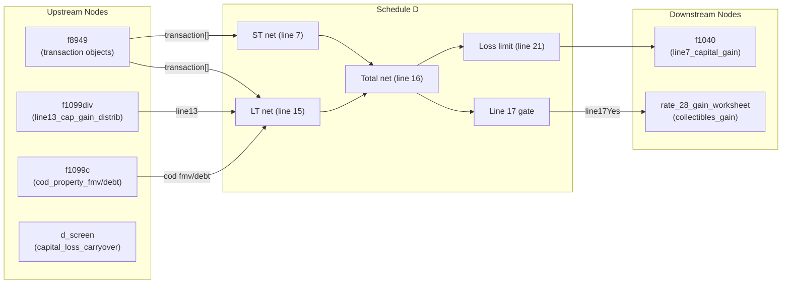

# Schedule D — Capital Gains and Losses

## Overview
Schedule D aggregates capital gains and losses from individual Form 8949 transactions, capital gain distributions (Form 1099-DIV), and COD property dispositions (Form 1099-C). It computes the net short-term and long-term capital gains or losses, applies the annual capital loss deduction limit, and routes the result to Form 1040 line 7a. When preferential long-term capital gain rates apply (line 17 = Yes), it also routes collectibles/QOF gain to the 28% Rate Gain Worksheet.

**IRS Form:** Schedule D (Form 1040)
**Drake Screen:** D
**Tax Year:** 2025
**Drake Reference:** screens.json `screen_code: "D"` confirmed
**IRS Form PDF:** `.research/docs/f1040sd.pdf`
**IRS Instructions PDF:** `.research/docs/i1040sd.pdf`

---

## Input Fields
Fields received from upstream NodeOutput objects.

| Field | Type | Source Node | Description | IRS Reference | Notes |
| ----- | ---- | ----------- | ----------- | ------------- | ----- |
| `transaction` | `Transaction \| Transaction[]` | f8949 | Individual transaction (part, proceeds, cost, gain_loss, is_long_term). Accumulates to array via executor merge pattern. | Sch D lines 1b/2/3/8b/9/10 | One NodeOutput per transaction from f8949 |
| `line13_cap_gain_distrib` | `number` | f1099div | Total capital gain distributions (box 2a of 1099-DIV) | Sch D line 13 | Instructions p.2: "total cap gain distributions paid, regardless of holding period" |
| `box2c_qsbs` | `number` | f1099div | Section 1202 (QSBS) portion of cap gain distributions (box 2c) | Sch D line 13 footnote | Informational — subset of line13; 1202 exclusion not yet implemented |
| `cod_property_fmv` | `number \| number[]` | f1099c | FMV of property in COD disposition. Accumulates to array when multiple items. | Sch D line 11 | Gain = FMV - debt_cancelled per item |
| `cod_debt_cancelled` | `number \| number[]` | f1099c | Cancelled debt amount, paired with cod_property_fmv | Sch D line 11 | Parallel array with cod_property_fmv |
| `capital_loss_carryover` | `number` | d_screen | Computed carryforward from d_screen computation — informational, for next year | Sch D Capital Loss Carryover Worksheet | Not used in current-year computation |
| `filing_status` | `FilingStatus` | (optional) | Determines capital loss deduction limit (MFS = $1,500, all others = $3,000) | Sch D line 21 | Optional; defaults to standard $3,000 limit |

**Transaction object shape (from f8949):**
| Sub-field | Type | Description |
| --------- | ---- | ----------- |
| `part` | `"A"\|"B"\|...\|"L"` | Form 8949 checkbox (A/G = ST basis reported; B/H = ST no basis; C/I = ST no 1099-B; D/J = LT basis reported; E/K = LT no basis; F/L = LT no 1099-B) |
| `description` | `string` | Asset description |
| `date_acquired` | `string` | Acquisition date |
| `date_sold` | `string` | Sale/exchange date |
| `proceeds` | `number` | Column (d) — sales price |
| `cost_basis` | `number` | Column (e) — cost or other basis |
| `adjustment_codes` | `string?` | Column (f) — adjustment codes (C=collectibles, Q=QOF) |
| `adjustment_amount` | `number?` | Column (g) — adjustment to gain/loss |
| `gain_loss` | `number` | Column (h) — computed gain or loss |
| `is_long_term` | `boolean` | True for Parts D/E/F/J/K/L |

---

## Calculation Logic

### Step 1 — Normalize inputs
Executor accumulation pattern: when multiple f8949 NodeOutputs deposit to `schedule_d`, the `transaction` key accumulates from a scalar to an array. Same for `cod_property_fmv` and `cod_debt_cancelled`. Normalize each to array before processing.

> **Source:** `core/runtime/executor.ts`, `mergePending()` — scalar + scalar → promoted to array

### Step 2 — Aggregate short-term transaction gains (Part I)
Sum `gain_loss` for all transactions where `is_long_term === false`.
This covers lines 1b + 2 + 3 aggregated (each Part A/B/C/G/H/I transaction).

> **Source:** Schedule D (Form 1040) 2025, Part I header; i1040sd.pdf p.1

### Step 3 — Aggregate long-term transaction gains (Part II)
Sum `gain_loss` for all transactions where `is_long_term === true`.
This covers lines 8b + 9 + 10 aggregated (each Part D/E/F/J/K/L transaction).

> **Source:** Schedule D (Form 1040) 2025, Part II header; i1040sd.pdf p.1

### Step 4 — Compute COD property LT gain (Line 11 contribution)
For each paired (fmv, debt_cancelled) item: `gain = fmv - debt_cancelled`.
Sum all such gains → contributes to long-term net (line 11 slot).

> **Source:** IRS instructions — COD property dispositions reported on Schedule D; i1040sd.pdf p.3

### Step 5 — Compute Net Short-Term (Line 7)
`line7 = stTxGain`

> **Source:** Schedule D (Form 1040) 2025, line 7: "Combine lines 1a through 6"

### Step 6 — Compute Net Long-Term (Line 15)
`line15 = ltTxGain + ltCodGain + (line13_cap_gain_distrib ?? 0)`

> **Source:** Schedule D (Form 1040) 2025, line 15: "Combine lines 8a through 14"

### Step 7 — Compute Total Net Capital Gain or Loss (Line 16)
`line16 = line7 + line15`

> **Source:** Schedule D (Form 1040) 2025, line 16: "Combine lines 7 and 15"

### Step 8 — Line 17 gate (preferential rate eligibility)
`line17Yes = line15 > 0 AND line16 > 0`
If line17Yes, proceed to compute 28% rate gain.

> **Source:** Schedule D (Form 1040) 2025, line 17: "Are lines 15 and 16 both gains?"

### Step 9 — Compute 28% Rate Gain (Line 18)
Only when line17Yes = true.
Filter LT transactions where `adjustment_codes` contains "C" (collectibles) or "Q" (QOF).
Sum their `gain_loss` values.

Adjustment codes: C = collectibles (IRC §1(h)(5)); Q = QOF gain (IRC §1400Z-2)

> **Source:** Schedule D (Form 1040) 2025, line 18; 28% Rate Gain Worksheet instructions; i1040sd.pdf p.2

### Step 10 — Apply capital loss deduction limit (Line 21)
Only when `line16 < 0`:
- MFS: `deductible = max(-1_500, line16)` → f1040 reports `-1_500` or actual loss (whichever is less in magnitude)
- All others: `deductible = max(-3_000, line16)` → f1040 reports `-3_000` or actual loss

When `line16 >= 0`: `capitalGainForReturn = line16`
When `line16 < 0`: `capitalGainForReturn = max(lossLimit, line16)`

> **Source:** Schedule D (Form 1040) 2025, line 21; i1040sd.pdf "Capital Losses" section p.3

### Step 11 — Route to Form 1040
Always emit `line7_capital_gain = capitalGainForReturn` to f1040.

> **Source:** Schedule D (Form 1040) 2025, line 16/21 → Form 1040 line 7a

### Step 12 — Route to 28% Rate Gain Worksheet
If `line17Yes AND gain28Pct > 0`: emit `collectibles_gain_from_8949 = gain28Pct` to rate_28_gain_worksheet.

> **Source:** Schedule D (Form 1040) 2025, line 18

---

## Output Routing

| Output Field | Destination Node | Line / Field | Condition | IRS Reference |
| ------------ | ---------------- | ------------ | --------- | ------------- |
| `line7_capital_gain` | f1040 | Line 7a | Always | Sch D line 16/21 → 1040 line 7a |
| `collectibles_gain_from_8949` | rate_28_gain_worksheet | Line 18 input | line17Yes AND 28% gain > 0 | Sch D line 18 |

---

## Constants & Thresholds (Tax Year 2025)

| Constant | Value | Source |
| -------- | ----- | ------ |
| Standard capital loss deduction limit | -$3,000 | IRC §1211(b); i1040sd.pdf "Capital Losses" p.3 |
| MFS capital loss deduction limit | -$1,500 | IRC §1211(b); i1040sd.pdf "Capital Losses" p.3 |
| 28% rate gain codes | "C" (collectibles), "Q" (QOF) | Sch D line 18 instructions; i1040sd.pdf p.2 |

---

## Data Flow Diagram

---

## Edge Cases & Special Rules

1. **No inputs at all** — if no transactions, no distributions, and no COD items, emit nothing (early return).

2. **MFS filing status** — capital loss deduction capped at $1,500 instead of $3,000. Applies when `filing_status === FilingStatus.MFS`.

3. **Line 16 = 0** — emit `line7_capital_gain = 0` to f1040 (IRS says "enter -0-" but zero is the correct value).

4. **Line 16 is a loss > $3,000** — limit deduction to $3,000; the remaining loss carries forward to next year (tracked via d_screen's capital_loss_carryover output, separate mechanism).

5. **28% rate gain gate** — only route to rate_28_gain_worksheet when BOTH line 15 > 0 AND line 16 > 0 (line 17 = Yes). If either is zero or a loss, skip.

6. **Collectibles code "C"** — appears in `adjustment_codes` string as individual characters; must check each character separately.

7. **QOF code "Q"** — treated same as "C" for 28% rate gain routing.

8. **QSBS box2c** — accepted but informational only; Section 1202 exclusion not yet implemented; box2c is a subset of line13_cap_gain_distrib (not additive).

9. **COD property arrays** — `cod_property_fmv` and `cod_debt_cancelled` are parallel arrays; zip them for per-item gain computation.

10. **Executor accumulation** — `transaction` field arrives as single object for one f8949 output, auto-promoted to array for multiple; always normalize to array before processing.

---

## Sources

| Document | Year | Section | Saved as |
| -------- | ---- | ------- | -------- |
| IRS Schedule D (Form 1040) | 2025 | Parts I, II, III | `.research/docs/f1040sd.pdf` |
| IRS Instructions for Schedule D | 2025 | All | `.research/docs/i1040sd.pdf` |
| Upstream node code (d_screen, f8949, f1099div, f1099c) | TY2025 | compute() methods | Local codebase |
| core/runtime/executor.ts | — | mergePending() | Local codebase |
