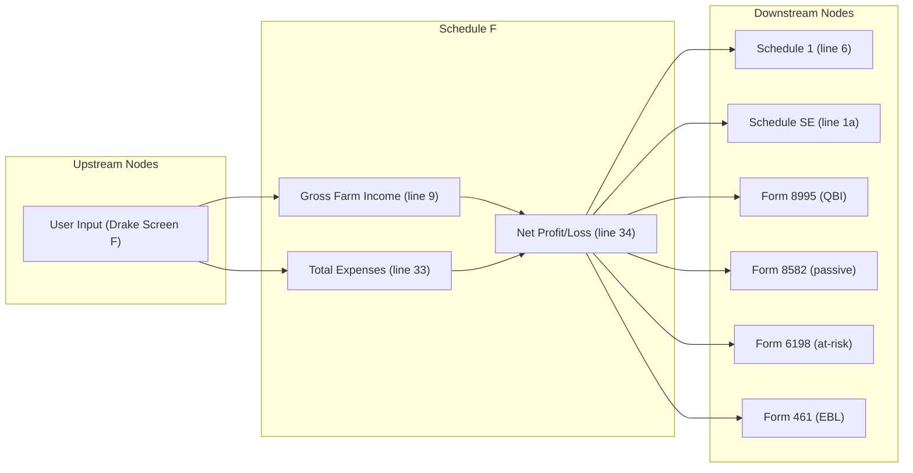

# Schedule F — Profit or Loss From Farming

## Overview
**IRS Form:** Schedule F (Form 1040)
**Drake Screen:** F
**Tax Year:** 2025

---
## Input Fields
| Field | Type | Source Node | Description | IRS Reference | URL |
| ----- | ---- | ----------- | ----------- | ------------- | --- |
| line_b_agricultural_activity_code | string | user | Principal agricultural activity code | Sch F Part IV | https://www.irs.gov/pub/irs-pdf/i1040sf.pdf |
| line_c_farm_name | string? | user | Name of farm | Sch F line C | https://www.irs.gov/pub/irs-pdf/i1040sf.pdf |
| line_d_ein | string? | user | Employer ID number | Sch F line D | https://www.irs.gov/pub/irs-pdf/i1040sf.pdf |
| line_e_material_participation | boolean | user | Did you materially participate? | Sch F line E | https://www.irs.gov/pub/irs-pdf/i1040sf.pdf |
| line_f_made_1099_payments | boolean? | user | Did you make payments requiring 1099? | Sch F line F | https://www.irs.gov/pub/irs-pdf/i1040sf.pdf |
| accounting_method | "cash"\|"accrual" | user | Cash or accrual | Sch F line C | https://www.irs.gov/pub/irs-pdf/i1040sf.pdf |
| line1_sales_livestock_resale | number | user | Sales of livestock and other resale items | Sch F Part I line 1 | https://www.irs.gov/pub/irs-pdf/i1040sf.pdf |
| line2_cost_livestock_resale | number? | user | Cost or basis of livestock on line 1 | Sch F Part I line 2 | https://www.irs.gov/pub/irs-pdf/i1040sf.pdf |
| line3a_cooperative_distributions | number? | user | Total cooperative distributions | Sch F Part I line 3a | https://www.irs.gov/pub/irs-pdf/i1040sf.pdf |
| line3b_cooperative_distributions_taxable | number? | user | Taxable cooperative distributions | Sch F Part I line 3b | https://www.irs.gov/pub/irs-pdf/i1040sf.pdf |
| line4a_ag_program_payments | number? | user | Total agricultural program payments | Sch F Part I line 4a | https://www.irs.gov/pub/irs-pdf/i1040sf.pdf |
| line4b_ag_program_payments_taxable | number? | user | Taxable agricultural program payments | Sch F Part I line 4b | https://www.irs.gov/pub/irs-pdf/i1040sf.pdf |
| line5a_ccc_loans_election | number? | user | CCC loans reported under election | Sch F Part I line 5a | https://www.irs.gov/pub/irs-pdf/i1040sf.pdf |
| line5b_ccc_loans_forfeited | number? | user | CCC loans forfeited (total) | Sch F Part I line 5b | https://www.irs.gov/pub/irs-pdf/i1040sf.pdf |
| line5c_ccc_loans_forfeited_basis | number? | user | CCC loans — basis adjustment | Sch F Part I line 5c | https://www.irs.gov/pub/irs-pdf/i1040sf.pdf |
| line6a_crop_insurance | number? | user | Crop insurance proceeds received | Sch F Part I line 6a | https://www.irs.gov/pub/irs-pdf/i1040sf.pdf |
| line6b_crop_insurance_taxable | number? | user | Crop insurance taxable in current year | Sch F Part I line 6b | https://www.irs.gov/pub/irs-pdf/i1040sf.pdf |
| line6d_crop_insurance_deferred | number? | user | Crop insurance deferred from prior year | Sch F Part I line 6d | https://www.irs.gov/pub/irs-pdf/i1040sf.pdf |
| line7_custom_hire_income | number? | user | Custom hire / machine work income | Sch F Part I line 7 | https://www.irs.gov/pub/irs-pdf/i1040sf.pdf |
| line8_other_income | number? | user | Other farm income | Sch F Part I line 8 | https://www.irs.gov/pub/irs-pdf/i1040sf.pdf |
| line10_car_truck | number? | user | Car and truck expenses | Sch F Part II line 10 | https://www.irs.gov/pub/irs-pdf/i1040sf.pdf |
| line11_chemicals | number? | user | Chemicals | Sch F Part II line 11 | https://www.irs.gov/pub/irs-pdf/i1040sf.pdf |
| line12_conservation | number? | user | Conservation expenses | Sch F Part II line 12 | https://www.irs.gov/pub/irs-pdf/i1040sf.pdf |
| line13_custom_hire | number? | user | Custom hire / machine work expense | Sch F Part II line 13 | https://www.irs.gov/pub/irs-pdf/i1040sf.pdf |
| line14_depreciation | number? | user | Depreciation / section 179 | Sch F Part II line 14 | https://www.irs.gov/pub/irs-pdf/i1040sf.pdf |
| line15_employee_benefits | number? | user | Employee benefit programs | Sch F Part II line 15 | https://www.irs.gov/pub/irs-pdf/i1040sf.pdf |
| line16_feed | number? | user | Feed purchased | Sch F Part II line 16 | https://www.irs.gov/pub/irs-pdf/i1040sf.pdf |
| line17_fertilizers | number? | user | Fertilizers and lime | Sch F Part II line 17 | https://www.irs.gov/pub/irs-pdf/i1040sf.pdf |
| line18_freight | number? | user | Freight and trucking | Sch F Part II line 18 | https://www.irs.gov/pub/irs-pdf/i1040sf.pdf |
| line19_gasoline | number? | user | Gasoline, fuel, and oil | Sch F Part II line 19 | https://www.irs.gov/pub/irs-pdf/i1040sf.pdf |
| line20_insurance | number? | user | Insurance (other than health) | Sch F Part II line 20 | https://www.irs.gov/pub/irs-pdf/i1040sf.pdf |
| line21a_interest_mortgage | number? | user | Mortgage interest | Sch F Part II line 21a | https://www.irs.gov/pub/irs-pdf/i1040sf.pdf |
| line21b_interest_other | number? | user | Other interest | Sch F Part II line 21b | https://www.irs.gov/pub/irs-pdf/i1040sf.pdf |
| line22_labor_hired | number? | user | Labor hired | Sch F Part II line 22 | https://www.irs.gov/pub/irs-pdf/i1040sf.pdf |
| line23_pension_plans | number? | user | Pension and profit-sharing plans | Sch F Part II line 23 | https://www.irs.gov/pub/irs-pdf/i1040sf.pdf |
| line24a_rent_vehicles | number? | user | Rent/lease vehicles, machinery | Sch F Part II line 24a | https://www.irs.gov/pub/irs-pdf/i1040sf.pdf |
| line24b_rent_land | number? | user | Rent/lease other property (land, pasture) | Sch F Part II line 24b | https://www.irs.gov/pub/irs-pdf/i1040sf.pdf |
| line25_repairs | number? | user | Repairs and maintenance | Sch F Part II line 25 | https://www.irs.gov/pub/irs-pdf/i1040sf.pdf |
| line26_seeds | number? | user | Seeds and plants | Sch F Part II line 26 | https://www.irs.gov/pub/irs-pdf/i1040sf.pdf |
| line27_storage | number? | user | Storage and warehousing | Sch F Part II line 27 | https://www.irs.gov/pub/irs-pdf/i1040sf.pdf |
| line28_supplies | number? | user | Supplies | Sch F Part II line 28 | https://www.irs.gov/pub/irs-pdf/i1040sf.pdf |
| line29_taxes | number? | user | Taxes | Sch F Part II line 29 | https://www.irs.gov/pub/irs-pdf/i1040sf.pdf |
| line30_utilities | number? | user | Utilities | Sch F Part II line 30 | https://www.irs.gov/pub/irs-pdf/i1040sf.pdf |
| line31_vet | number? | user | Veterinary, breeding, medicine | Sch F Part II line 31 | https://www.irs.gov/pub/irs-pdf/i1040sf.pdf |
| line32e_other_expenses | number? | user | Total other expenses (lines 32a–32e) | Sch F Part II line 32e | https://www.irs.gov/pub/irs-pdf/i1040sf.pdf |
| line36_at_risk | "a"\|"b"? | user | At-risk box (36a=all at risk, 36b=some not) | Sch F line 36 | https://www.irs.gov/pub/irs-pdf/i1040sf.pdf |
| filing_status | FilingStatus? | user | Filing status (for EBL threshold) | Form 461 | https://www.irs.gov/pub/irs-pdf/f461.pdf |

---
## Calculation Logic
### Step 1 — Gross Farm Income (line 9)
Sum: line 1 − line 2 (livestock resale profit) + line 3b + line 4b + line 5a + line 5b − line 5c + line 6b + line 6d + line 7 + line 8

### Step 2 — Total Expenses (line 33)
Sum all Part II expense lines 10–32f.
Conservation expenses (line 12) are limited to 25% of gross farm income.

### Step 3 — Net Profit / Loss (line 34)
line 34 = line 9 − line 33

### Step 4 — Output Routing
- Always → Schedule 1 line 6 (even if zero or negative)
- If net profit ≥ $400 → Schedule SE (net_profit_schedule_f)
- If net profit > 0 → Form 8995 (qbi_from_schedule_f)
- If material_participation = false → Form 8582 (passive_schedule_f)
- If at_risk = "b" and loss → Form 6198 (schedule_f_loss)
- If EBL threshold exceeded → Form 461

---
## Output Routing
| Output Field | Destination Node | Line / Field | Condition | IRS Reference | URL |
| ------------ | ---------------- | ------------ | --------- | ------------- | --- |
| line6_schedule_f | schedule1 | Line 6 | always | IRC §61 | https://www.irs.gov/pub/irs-pdf/i1040s1.pdf |
| net_profit_schedule_f | schedule_se | Line 1a | profit ≥ $400 | IRC §1402 | https://www.irs.gov/pub/irs-pdf/i1040sse.pdf |
| qbi_from_schedule_f | form8995 | — | profit > 0 | IRC §199A | https://www.irs.gov/pub/irs-pdf/f8995.pdf |
| passive_schedule_f | form8582 | — | not material participant | IRC §469 | https://www.irs.gov/pub/irs-pdf/f8582.pdf |
| schedule_f_loss | form6198 | — | loss + not all at risk | IRC §465 | https://www.irs.gov/pub/irs-pdf/f6198.pdf |
| excess_business_loss | form461 | — | loss > EBL threshold | IRC §461(l) | https://www.irs.gov/pub/irs-pdf/f461.pdf |

---
## Constants & Thresholds (Tax Year 2025)
| Constant | Value | Source | URL |
| -------- | ----- | ------ | --- |
| SE_TAX_THRESHOLD | $400 | IRC §1402(b) | https://www.irs.gov/pub/irs-pdf/i1040sse.pdf |
| CONSERVATION_LIMIT_PCT | 25% of gross farm income | Pub. 225 ch.5 | https://www.irs.gov/pub/irs-pdf/p225.pdf |
| EBL_THRESHOLD_SINGLE | $313,000 | IRC §461(l); Rev. Proc. 2024-40 | https://www.irs.gov/pub/irs-drop/rp-24-40.pdf |
| EBL_THRESHOLD_MFJ | $626,000 | IRC §461(l); Rev. Proc. 2024-40 | https://www.irs.gov/pub/irs-drop/rp-24-40.pdf |

---
## Data Flow Diagram

---
## Edge Cases & Special Rules
1. **Zero income + zero expenses** — no outputs (nothing to report)
2. **Loss → Schedule 1** — losses are reported (line 6 can be negative)
3. **Loss → Schedule SE** — losses do NOT route to SE (only profits ≥ $400)
4. **Conservation limit** — capped at 25% of gross farm income
5. **EBL** — uses same thresholds as Schedule C ($313k single / $626k MFJ)
6. **Accrual method** — node does not recompute; input fields carry accrual-adjusted amounts
7. **CCC loans** — line 5c (basis) is subtracted from line 5b (forfeited)

---
## Sources
| Document | Year | Section | URL | Saved as |
| -------- | ---- | ------- | --- | -------- |
| Instructions for Schedule F (Form 1040) | 2025 | All | https://www.irs.gov/pub/irs-pdf/i1040sf.pdf | .research/docs/i1040sf.pdf |
| Schedule F (Form 1040) | 2025 | — | https://www.irs.gov/pub/irs-pdf/f1040sf.pdf | — |
| Publication 225 (Farmer's Tax Guide) | 2025 | Ch. 4–8 | https://www.irs.gov/pub/irs-pdf/p225.pdf | — |
| IRC §1402 | — | SE income | https://uscode.house.gov/view.xhtml?req=granuleid:USC-prelim-title26-section1402 | — |
| IRC §461(l) | — | EBL | https://uscode.house.gov/view.xhtml?req=granuleid:USC-prelim-title26-section461 | — |
