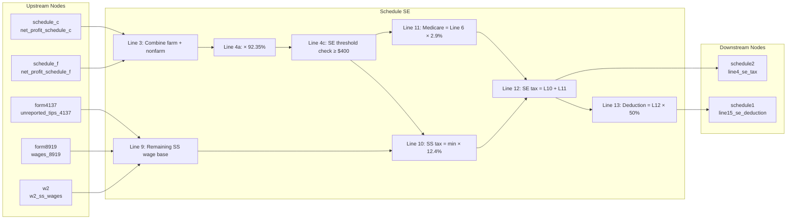

# Schedule SE — Self-Employment Tax

## Overview
Schedule SE computes self-employment (SE) tax for individuals with net self-employment income. It receives net profits from upstream nodes (Schedule C, Schedule F), unreported tips (Form 4137), and wages subject to SE (Form 8919). It applies the 92.35% net-earnings multiplier, computes the Social Security portion (12.4%, subject to the annual wage base) and Medicare portion (2.9%), then emits the SE tax to Schedule 2 (line 4) and the deductible half (50%) to Schedule 1 (line 15).

**IRS Form:** Schedule SE (Form 1040)
**Drake Screen:** SE
**Tax Year:** 2025
**Drake Reference:** https://kb.drakesoftware.com/Site/Browse/13034

---

## Input Fields
Fields received from upstream NodeOutput objects.

| Field | Type | Source Node | Description | IRS Reference | URL |
| ----- | ---- | ----------- | ----------- | ------------- | --- |
| net_profit_schedule_c | number (optional) | schedule_c | Net profit/loss from Schedule C, line 31 | Sch SE Line 2 | f1040se.pdf |
| net_profit_schedule_f | number (optional) | schedule_f | Net farm profit/loss from Schedule F, line 34 | Sch SE Line 1a | f1040se.pdf |
| unreported_tips_4137 | number (optional) | form4137 | Unreported tips subject to SE from Form 4137, line 10 | Sch SE Line 8b | f1040se.pdf |
| wages_8919 | number (optional) | form8919 | Wages subject to SE from Form 8919, line 10 | Sch SE Line 8c | f1040se.pdf |
| w2_ss_wages | number (optional) | w2 | Combined W-2 SS wages (boxes 3+7) for wage base offset | Sch SE Line 8a | f1040se.pdf |

---

## Calculation Logic

### Step 1 — Farm net earnings (Line 1a)
Farm profit from Schedule F. Enter net_profit_schedule_f (may be negative).
> **Source:** Schedule SE (Form 1040) 2025, Part I Line 1a — .research/docs/f1040se.pdf

### Step 2 — Nonfarm net profit (Line 2)
Net profit from Schedule C line 31 (and K-1 box 14 code A for nonfarm).
> **Source:** Schedule SE (Form 1040) 2025, Part I Line 2 — .research/docs/f1040se.pdf

### Step 3 — Combine (Line 3)
Line 3 = Line 1a + Line 2
(Line 1b for Conservation Reserve Program payments — not in scope)
> **Source:** Schedule SE (Form 1040) 2025, Part I Line 3 — .research/docs/f1040se.pdf

### Step 4 — Net earnings from self-employment (Line 4a)
If Line 3 > 0: Line 4a = Line 3 × 0.9235
If Line 3 ≤ 0: Line 4a = Line 3 (enter as-is per instructions)
> **Source:** Schedule SE (Form 1040) 2025, Part I Line 4a — .research/docs/f1040se.pdf

### Step 5 — SE threshold check (Line 4c)
Line 4c = Line 4a (+ optional methods Line 4b, not in scope)
If Line 4c < $400 → no SE tax; stop computation (return empty outputs).
Exception: if church employee income exists, enter -0- and continue (church income not in scope).
> **Source:** Schedule SE (Form 1040) 2025, Part I Line 4c note — .research/docs/f1040se.pdf

### Step 6 — Line 6 (total SE earnings)
Line 6 = Line 4c + Line 5b (church employee income × 92.35%; not in scope)
In practice: Line 6 = Line 4a (nonfarm only)
> **Source:** Schedule SE (Form 1040) 2025, Part I Line 6 — .research/docs/f1040se.pdf

### Step 7 — SS wage base (Line 7)
Fixed constant for TY2025: $176,100
> **Source:** Rev Proc 2024-40; Schedule SE (Form 1040) 2025, Part I Line 7 — .research/docs/f1040se.pdf

### Step 8 — Offset W-2 wages from wage base (Lines 8a–8d)
Line 8a = Total SS wages from W-2 forms (w2_ss_wages)
Line 8b = Unreported tips from Form 4137 line 10 (unreported_tips_4137)
Line 8c = Wages subject to SS from Form 8919 line 10 (wages_8919)
Line 8d = 8a + 8b + 8c
> **Source:** Schedule SE (Form 1040) 2025, Part I Lines 8a–8d — .research/docs/f1040se.pdf

### Step 9 — Remaining wage base (Line 9)
Line 9 = max(0, Line 7 − Line 8d)
If Line 9 = 0, skip lines 8b–10 and go to Line 11 (no additional SS tax).
> **Source:** Schedule SE (Form 1040) 2025, Part I Line 9 — .research/docs/f1040se.pdf

### Step 10 — Social Security tax portion (Line 10)
Line 10 = min(Line 6, Line 9) × 0.124
> **Source:** Schedule SE (Form 1040) 2025, Part I Line 10 — .research/docs/f1040se.pdf

### Step 11 — Medicare tax portion (Line 11)
Line 11 = Line 6 × 0.029
> **Source:** Schedule SE (Form 1040) 2025, Part I Line 11 — .research/docs/f1040se.pdf

### Step 12 — Total SE tax (Line 12)
Line 12 = Line 10 + Line 11
Routed to Schedule 2 (Form 1040), line 4.
> **Source:** Schedule SE (Form 1040) 2025, Part I Line 12 — .research/docs/f1040se.pdf

### Step 13 — SE deduction (Line 13)
Line 13 = Line 12 × 0.50
Routed to Schedule 1 (Form 1040), line 15.
> **Source:** Schedule SE (Form 1040) 2025, Part I Line 13 — .research/docs/f1040se.pdf

---

## Output Routing

| Output Field | Destination Node | Line / Field | Condition | IRS Reference | URL |
| ------------ | ---------------- | ------------ | --------- | ------------- | --- |
| se_tax | schedule2 | line 4 | SE earnings ≥ $400 | Sch SE Line 12 | f1040se.pdf |
| se_deduction | schedule1 | line 15 | SE earnings ≥ $400 | Sch SE Line 13 | f1040se.pdf |

---

## Constants & Thresholds (Tax Year 2025)

| Constant | Value | Source | URL |
| -------- | ----- | ------ | --- |
| SS wage base | $176,100 | Rev Proc 2024-40; Sch SE Line 7 | .research/docs/f1040se.pdf |
| SE earnings threshold | $400 | IRC §1402(b); Sch SE Line 4c | .research/docs/f1040se.pdf |
| Net earnings multiplier | 92.35% (0.9235) | IRC §1402(a)(12) | .research/docs/f1040se.pdf |
| SS tax rate | 12.4% (0.124) | IRC §1401(a) | .research/docs/f1040se.pdf |
| Medicare tax rate | 2.9% (0.029) | IRC §1401(b) | .research/docs/f1040se.pdf |
| SE deduction rate | 50% (0.50) | IRC §164(f) | .research/docs/f1040se.pdf |

---

## Data Flow Diagram

---

## Edge Cases & Special Rules

1. **SE earnings below $400**: If line 4c < $400 and no church employee income, no SE tax is owed. Return empty outputs.
2. **SS wage base fully offset**: If W-2 wages + unreported tips + form 8919 wages ≥ $176,100, line 9 = 0. Only Medicare tax applies (line 10 = 0, line 11 still computed).
3. **Negative net profit**: If line 3 ≤ 0 (net loss), line 4a is entered as-is (loss). Line 4c ≤ 0 → below $400 threshold → no SE tax.
4. **Farm income (Schedule F)**: Included in line 1a. Combined with Schedule C in line 3.
5. **Multiple Schedule C businesses**: schedule_c node aggregates and sends a single combined net profit. Schedule SE receives one total.
6. **Church employee income** (lines 5a/5b): Out of scope for current implementation.
7. **Optional methods** (Part II): Out of scope for current implementation.

---

## Sources

| Document | Year | Section | URL | Saved as |
| -------- | ---- | ------- | --- | -------- |
| Schedule SE (Form 1040) | 2025 | Part I | https://www.irs.gov/pub/irs-pdf/f1040se.pdf | .research/docs/f1040se.pdf |
| Instructions for Schedule SE | 2025 | All | https://www.irs.gov/pub/irs-pdf/i1040sse.pdf | .research/docs/i1040sse.pdf |
| Rev Proc 2024-40 | 2024 | §3.28 | https://www.irs.gov/pub/irs-drop/rp-24-40.pdf | (SS wage base $176,100) |
