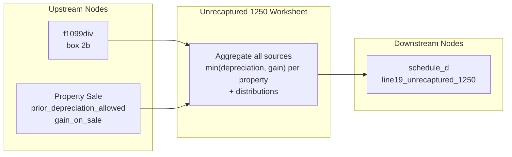

# Unrecaptured Section 1250 Gain Worksheet

## Overview
**IRS Form:** Schedule D Tax Worksheet — Unrecaptured Section 1250 Gain
**Drake Screen:** None (no dedicated screen; data flows from f1099div box 2b and property sale nodes)
**Tax Year:** 2025

---
## Input Fields
| Field | Type | Source Node | Description | IRS Reference | URL |
| ----- | ---- | ----------- | ----------- | ------------- | --- |
| unrecaptured_1250_gain | number (nonneg) | f1099div | Unrecaptured §1250 gain distributions (1099-DIV box 2b) | Sch D Instructions p.14 | https://www.irs.gov/instructions/i1040sd |
| prior_depreciation_allowed | number (nonneg) | (property sale) | Cumulative straight-line depreciation taken on real property | IRC §1250; Pub 544 | https://www.irs.gov/pub/irs-pdf/p544.pdf |
| gain_on_sale | number (nonneg) | (property sale) | Realized gain on sale of real property | IRC §1250 | https://www.irs.gov/pub/irs-pdf/p544.pdf |

---
## Calculation Logic
### Step 1 — Unrecaptured Section 1250 Gain

Unrecaptured §1250 gain is the portion of gain from selling depreciable real property
that is attributable to prior straight-line depreciation. It is taxed at a maximum 25% rate.

For each property:
  - property_1250_gain = min(prior_depreciation_allowed, gain_on_sale)

Total worksheet amount = sum of all property gains + unrecaptured_1250_gain (from distributions)

This amount is limited by the actual long-term capital gain available (handled by the
Schedule D Tax Worksheet, not this node).

---
## Output Routing
| Output Field | Destination Node | Line / Field | Condition | IRS Reference | URL |
| ------------ | ---------------- | ------------ | --------- | ------------- | --- |
| line19_unrecaptured_1250 | schedule_d | Line 19 | total > 0 | Sch D line 19 | https://www.irs.gov/instructions/i1040sd |

---
## Constants & Thresholds (Tax Year 2025)
| Constant | Value | Source | URL |
| -------- | ----- | ------ | --- |
| Max §1250 rate | 25% | IRC §1(h)(1)(D) | https://www.law.cornell.edu/uscode/text/26/1 |

---
## Data Flow Diagram

---
## Edge Cases & Special Rules

1. **Zero depreciation**: If no prior depreciation (prior_depreciation_allowed = 0), no §1250 gain applies.
2. **Gain cap**: Property gain limited to min(prior_depreciation_allowed, gain_on_sale) — cannot exceed actual gain.
3. **Distributions only**: f1099div box 2b distributions are fully included (pre-computed by fund).
4. **Multiple properties**: Accumulation pattern — each property contributes independently; totals are summed.
5. **No output when zero**: If total unrecaptured 1250 gain = 0, return empty outputs (early return).

---
## Sources
| Document | Year | Section | URL | Saved as |
| -------- | ---- | ------- | --- | -------- |
| Schedule D Instructions | 2025 | Unrecaptured §1250 Gain Worksheet | https://www.irs.gov/instructions/i1040sd | i1040sd.pdf |
| IRC §1250 | current | Depreciation recapture — real property | https://www.law.cornell.edu/uscode/text/26/1250 | — |
| IRC §1(h)(1)(D) | current | 25% rate for unrecaptured §1250 gain | https://www.law.cornell.edu/uscode/text/26/1 | — |
| Publication 544 | 2024 | Sales and Other Dispositions of Assets | https://www.irs.gov/pub/irs-pdf/p544.pdf | p544.pdf |
